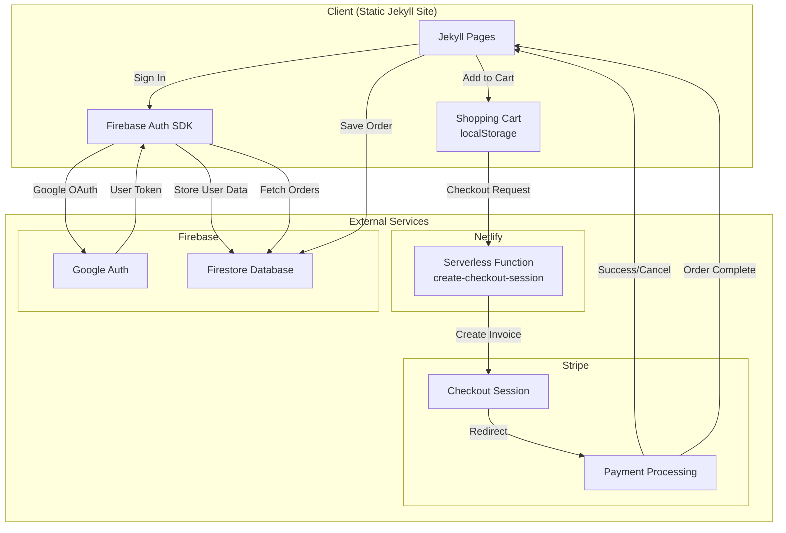

# E-Commerce Jekyll Template

A flexible, customizable e-commerce template built with Jekyll. Features a complete shopping cart system with Stripe payments and Google authentication.

## Architecture



### Data Flow

| Flow | Description |
|------|-------------|
| **Cart** | Products added to localStorage → Checkout sends line items to Netlify → Netlify creates Stripe session → User redirected to Stripe payment |
| **Auth** | User clicks Sign In → Firebase Auth opens Google popup → User authenticates → Token stored locally → User data saved to Firestore |
| **Orders** | Payment completes → Order saved to Firestore → User can view order history in account page |

### Technology Stack

- **Frontend**: Jekyll (static site generator)
- **Cart Storage**: Browser localStorage
- **Payments**: Stripe Checkout (via Netlify Functions)
- **Authentication**: Firebase Auth (Google Sign-In)
- **Database**: Firestore (user profiles & order history)
- **Hosting**: GitHub Pages / Netlify

---

## Features

### Shopping & Payments
- **Shopping Cart** - Add to cart, quantity controls, persistent localStorage
- **Stripe Checkout** - Secure payment processing via Netlify serverless function
- **Product Badges** - Automatic "Sale", "New", "Limited Edition" badges

### User Accounts
- **Google Sign-In** - One-click authentication via Firebase
- **User Profiles** - Display name and avatar from Google account
- **Order History** - Track past purchases in account page

### Product Management
- **7 Main Categories** with subcategories (fully customizable)
- **Multi-category products** using tags (products can appear in multiple categories)
- **Featured/Special categories** (On Sale, New Arrivals, Limited Edition, etc.)
- **Sale Pricing** - Original price strikethrough with sale price display

### Design & UX
- **Responsive design** - Works on desktop, tablet, and mobile
- **Logo support** with automatic placeholder images
- **Favicon setup** - Complete placeholder system for all devices
- **Clean, modern UI** - Professional e-commerce appearance

## Quick Start

1. Install dependencies:
   ```bash
   bundle install
   ```

2. Run the development server:
   ```bash
   bundle exec jekyll serve
   ```

3. Open your browser to `http://localhost:4000`

## Configuration

### Stripe Setup

1. Create a [Stripe account](https://stripe.com)
2. Get your publishable key from Stripe Dashboard
3. Deploy a Netlify function for checkout (see `/netlify/functions/`)
4. Update `_config.yml`:

```yaml
stripe:
  site_id: "your_site_id"        # Unique identifier for cart storage
  mode: "test"                    # "test" or "live"
  publishable_key_test: "pk_test_..."
  publishable_key_live: "pk_live_..."
  checkout_url_test: "https://your-site.netlify.app/.netlify/functions/create-checkout-session"
  checkout_url_live: "https://your-site.netlify.app/.netlify/functions/create-checkout-session"
```

5. Add `price_id` to each product (from Stripe Dashboard):

```yaml
# In _products/your-product.md
price_id: "price_1ABC..."  # Stripe Price ID
```

### Firebase Setup

1. Create a [Firebase project](https://console.firebase.google.com)
2. Enable **Google Sign-In** in Authentication → Sign-in method
3. Create a **Firestore Database** in test mode
4. Update `_config.yml`:

```yaml
firebase:
  api_key: "AIza..."
  auth_domain: "your-project.firebaseapp.com"
  project_id: "your-project"
  storage_bucket: "your-project.appspot.com"
  app_id: "1:123:web:abc"
```

5. Set Firestore security rules:

```
rules_version = '2';
service cloud.firestore {
  match /databases/{database}/documents {
    match /users/{userId} {
      allow read, write: if request.auth != null && request.auth.uid == userId;
    }
    match /orders/{orderId} {
      allow read: if request.auth != null && resource.data.userId == request.auth.uid;
      allow create: if request.auth != null && request.resource.data.userId == request.auth.uid;
    }
  }
}
```

## Documentation

📚 **All guides are in the `/guides/` folder** - See [guides/README.md](guides/README.md) for a complete index.

**Quick Links:**
- [Setup & Installation](guides/SETUP.md)
- [Customization Guide](guides/CUSTOMIZATION_QUICK_START.md)
- [Multi-Category Products](guides/MULTI_CATEGORY_SUMMARY.md)
- [Images Guide](guides/IMAGES_GUIDE.md)
- [Favicon Setup](guides/FAVICON_GUIDE.md)
- [Project Structure](guides/STRUCTURE.md)

## Customization

### Site Information
Edit `_data/site.yml` to customize:
- Business name and tagline
- Contact information
- Social media links
- Footer links

### Categories
Edit `_data/categories.yml` to replace generic placeholders:
- Change "Category 1" to your actual category names (e.g., "Electronics", "Clothing", "Books")
- Replace "Category 1-1" subcategories with real names (e.g., "Laptops", "Desktops")
- Update category slugs to match your naming

### Adding Products
Create new files in `_products/` directory:

```yaml
---
title: "Product Name"
price: 29.99
original_price: 39.99        # Optional: for sale items
category: category-slug       # Main category
subcategory: subcategory-slug # Main subcategory
tags:                         # Optional: appear in multiple categories
  - on-sale
  - new-arrival
  - featured
sku: "PRD-001"
stock_status: in-stock
description: "Product description"
image: /assets/images/product.jpg
---

Additional product details in markdown format.
```

**See `MULTI_CATEGORY_GUIDE.md` for details on making products appear in multiple categories using tags.**

### Styling
- Main styles: `assets/css/style.css`
- Modify colors, fonts, and layout as needed

## Structure

```
.
├── _config.yml              # Jekyll + Stripe + Firebase config
├── _data/
│   ├── categories.yml       # Category structure
│   └── site.yml             # Site settings
├── _includes/
│   ├── header.html          # Site header with auth
│   ├── navigation.html      # Main navigation
│   ├── footer.html          # Site footer
│   ├── stripe-cart.html     # Cart dropdown UI
│   ├── stripe-config.html   # Stripe JS config
│   └── firebase-config.html # Firebase SDK init
├── _layouts/
│   ├── default.html         # Base layout
│   ├── category.html        # Category pages
│   ├── product.html         # Product pages
│   └── page.html            # Static pages
├── _products/               # Product files (with price_id)
├── assets/
│   ├── css/style.css        # All styles
│   └── js/
│       ├── stripe-cart.js   # Cart & checkout logic
│       └── firebase-auth.js # Auth & user management
├── account.html             # User account page
├── cart.html                # Full cart page
├── checkout/
│   ├── success.html         # Payment success
│   └── cancel.html          # Payment cancelled
├── category/                # Category pages
└── index.html               # Homepage
```

## Creating a New Store

1. Clone this repository
2. Run `bundle install` to install dependencies
3. Update `_data/site.yml` with your store information
4. Replace `assets/images/store-image.jpg` with your logo
5. **Generate and add favicons to `assets/favicons/`**
6. Modify `_data/categories.yml` for your product categories
7. Add your products to `_products/` (organize in folders by category)
8. Add product images to `assets/images/`
9. Customize colors/styles in `assets/css/style.css`

**See [guides/README.md](guides/README.md) for all documentation.**

## Deployment

This template can be deployed to:
- GitHub Pages
- Netlify
- Vercel
- Any static hosting service

## License

See LICENSE file for details.
